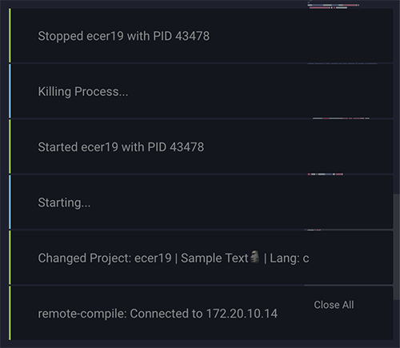

# remote-compile package

remote-compile Client for Atom.


## Getting Started
This plugin is best used with [rempote-ftp](https://github.com//icetee/remote-ftp) and relies on its .ftpconfig file.

1. Create an .ftpconfig file.
2. Start the remote-compile server on your wallaby.
3. Call remote-compile:toggle
4. Profit.

## Functionality
TODO

## Shortcuts
|       Function    |       Mac        |
|-----------        | :--------------: |
| Toggle            |  ctrl + cmd + o  |
| Change Project    |  ctrl + cmd + c  |
| Run               |  ctrl + cmd + d  |
| Kill              | ctrl + cmd  + u  |

## Config File
```
{
    "host":"example.com",
    "rcuser":"",
    "rcpassword":""
}
```

## Credits
  - [Rafael Schreiber](https://github.com/rafaelschreiber)
